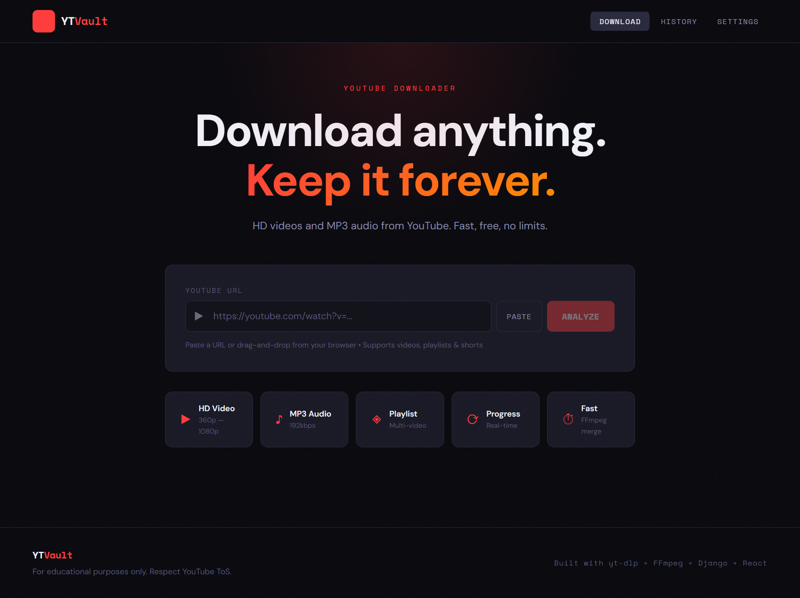
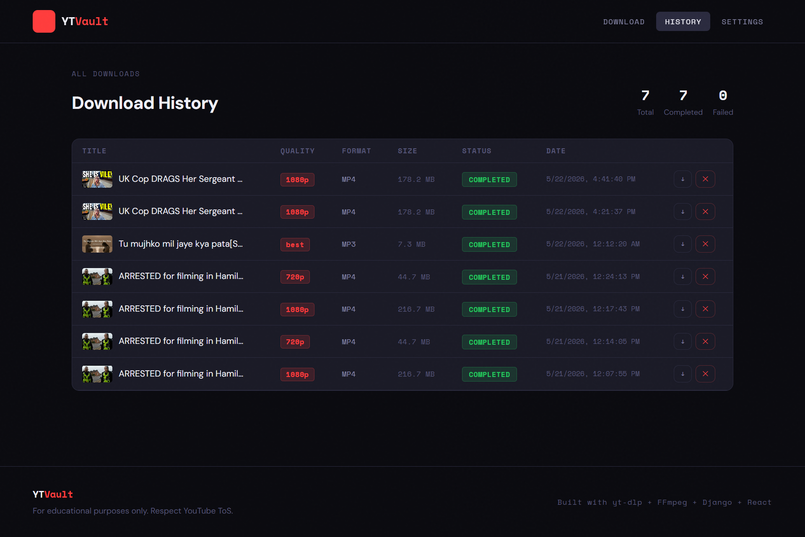
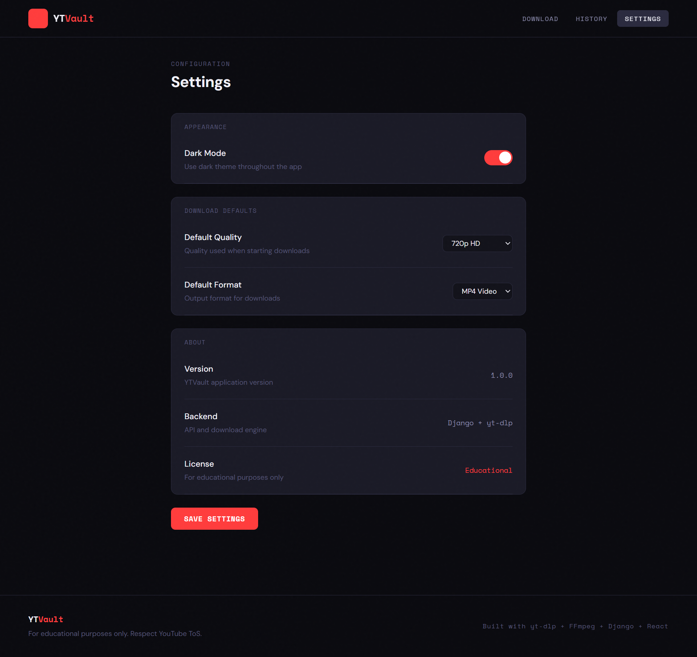

# YTVault — YouTube Video Downloader

> **Educational purposes only.** This application is intended to demonstrate full-stack development with Django + React. Always respect YouTube's Terms of Service and only download content you have permission to access.

---

## Features

**Core**
- Paste a YouTube URL and fetch full video metadata
- Select quality (360p / 480p / 720p / 1080p / Best)
- Download as MP4 video or MP3 audio
- Real-time progress tracking with speed and ETA
- Cancel in-progress downloads
- Full download history with file management

**Technical**
- Background download threads (no blocking)
- FFmpeg stream merging for HD video
- yt-dlp for reliable extraction and download
- SQLite persistence for history
- CORS-safe REST API
- API rate limiting

---

## Tech Stack

| Layer | Technology |
|-------|-----------|
| Frontend | React 18, Vite, Bootstrap 5 |
| State | Context API, React Hooks |
| HTTP | Axios |
| Backend | Django 4.2, Django REST Framework |
| Downloader | yt-dlp |
| Media | FFmpeg |
| Database | SQLite |
| Container | Docker + Docker Compose |

---

## Project Structure

```
ytdl/
├── backend/
│   ├── downloader_project/    # Django project config
│   ├── downloader_app/
│   │   ├── models.py          # DownloadHistory model
│   │   ├── views.py           # REST API views
│   │   ├── serializers.py     # DRF serializers
│   │   ├── urls.py            # API routes
│   │   ├── services/
│   │   │   ├── ytdlp_service.py    # yt-dlp integration
│   │   │   └── download_manager.py # Background threading
│   │   └── utils/
│   │       ├── validators.py  # URL validation
│   │       ├── helpers.py     # Format utilities
│   │       └── logger.py      # Logging setup
│   ├── downloads/             # Downloaded files
│   ├── requirements.txt
│   └── manage.py
│
└── frontend/
    ├── src/
    │   ├── components/        # Reusable UI
    │   ├── pages/             # Route pages
    │   ├── services/api.js    # Axios API client
    │   └── context/           # Global state
    ├── package.json
    └── vite.config.js
```

## 📸 Screenshots

| Home | History | Settings |
|------|---------|----------|
|  |  |  |

---

## Quick Start (Docker)

```bash
# Clone and start everything
git clone <repo>
cd ytdl
docker-compose up --build

# App available at:
# Frontend: http://localhost
# Backend API: http://localhost:8000/api/
```

---

## Manual Setup

### Prerequisites
- Python 3.10+
- Node.js 18+
- FFmpeg installed on your system

### FFmpeg Installation

**macOS:**
```bash
brew install ffmpeg
```

**Ubuntu/Debian:**
```bash
sudo apt update && sudo apt install ffmpeg
```

**Windows:**
Download from https://ffmpeg.org/download.html and add to PATH.

### Backend Setup

```bash
cd backend

# Create virtual environment
python -m venv venv
source venv/bin/activate  # Windows: venv\Scripts\activate

# Install dependencies
pip install -r requirements.txt

# Create .env file
cp .env .env.local
# Edit .env.local with your settings

# Run migrations
python manage.py migrate

# Start server
python manage.py runserver
```

Backend runs at `http://localhost:8000`

### Frontend Setup

```bash
cd frontend

# Install dependencies
npm install

# Start dev server
npm run dev
```

Frontend runs at `http://localhost:5173`

The Vite dev server proxies `/api` requests to Django automatically.

---

## API Documentation

### POST `/api/analyze/`
Extract metadata from a YouTube URL.

**Request:**
```json
{ "url": "https://youtube.com/watch?v=..." }
```

**Response:**
```json
{
  "success": true,
  "data": {
    "title": "Video Title",
    "thumbnail": "https://...",
    "duration": 243,
    "uploader": "Channel Name",
    "available_qualities": ["360p", "480p", "720p", "1080p"],
    "formats": ["mp4", "mp3"]
  }
}
```

---

### POST `/api/download/`
Start a download task.

**Request:**
```json
{ "url": "https://...", "quality": "720p", "format": "mp4" }
```

**Response:**
```json
{ "success": true, "task_id": "uuid-string" }
```

---

### GET `/api/progress/<task_id>/`
Poll download progress.

**Response:**
```json
{
  "task_id": "...",
  "status": "downloading",
  "progress": 42.5,
  "download_speed": "3.2 MB/s",
  "eta": "18s"
}
```

Status values: `pending` → `downloading` → `processing` → `completed` | `failed` | `cancelled`

---

### POST `/api/cancel/<task_id>/`
Cancel an active download.

---

### GET `/api/history/`
Return all download history (last 100).

---

### DELETE `/api/history/<id>/`
Delete a history entry and its file.

---

### GET `/api/file/<task_id>/`
Download the completed file (triggers browser download).

---

## Environment Variables

```env
SECRET_KEY=your-secret-key
DEBUG=True
ALLOWED_HOSTS=localhost,127.0.0.1
LOG_LEVEL=INFO
```

---

## Notes

- Downloads are saved to `backend/downloads/`
- SQLite database: `backend/db.sqlite3`
- Only YouTube URLs are accepted (validated server-side)
- Downloads run in background threads; progress is polled every second
- Files are served directly by Django in dev; use nginx in production
